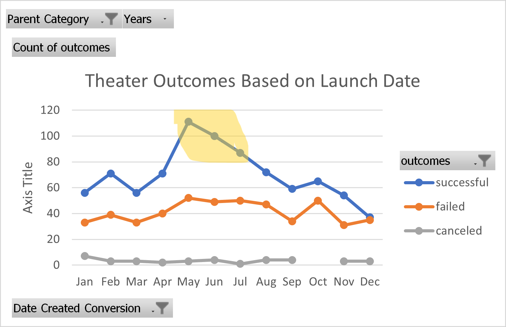

# Excel--Kickstarter_Goal_Funding

### Online workbook:   [Lesson_Workbook.xlsx]( Lesson_Workbook.xlsx) | [Lesson Notes](Lesson_Notes.pdf)

Featuring: Excel formatting, filtering, pivot tables, functions, vlookups, graphs & charts, statistics (measures of central tendency, quartiles, & outliers)

### Bootcamp challenge:  [Kickstarter_Challenge.xlsx]( Kickstarter_Challenge.xlsx)
Louise’s play Fever came close to its fundraising goal in a short amount of time. Now, she wants to know how different campaigns fared in relation to their launch dates and their funding goals. 
1. Use pivot tables to visualize campaign outcomes ("successful," "failed," and "canceled") based on launch date.
2. Use Countifs to visualize the percentage of successful, failed, and canceled plays based on the funding goal amount. 
3. Explain how you performed your analysis using images and links to code, as well as any challenges you encountered and how you overcame them. If you had no challenges, describe any possible challenges or difficulties that could be encountered.
4. Results: 
   - What are two conclusions you can draw about the Theater Outcomes by Launch Date?
   - What can you conclude about the Outcomes based on Goals?
   - What are some limitations of this dataset?
   - What are some other possible tables and/or graphs that we could create?

------------------------------------------------------

# Wash your theatrical-funding-worries away!

### When launching a kickstarter campaign for your next theatrical production, start with 2 key questions: 
1. How much should you set your goal for?
   - most success: $35,000-$40,000
   - 2nd best success: less than $1,000
2. What is the best time of year to launch your kickstarter?
   - Best month: May   
   - 2nd best month: June   
   - 3rd best month: July 

### Validation  [Kickstarter_Challenge.xlsx]( Kickstarter_Challenge.xlsx)

#### Inspect the Data
Data gathered from over 4,000 kickstarted campaigns from all over the world. Out of 9 subcategories, over 25% of the kickstarters were for theatre productions!  This tells us kickstarter funding is a very popular mean of raising money for theatre productions. We're already off to a positive start!

#### 1. How much should you set my goal for? :heavy_dollar_sign:
The most success came from kickstarters asking for under $1,000 goal. The second most successful range was $35,000-$40,000. Maybe there is a split between wealthier people's donations and the "starving artist" supporters' donations. Maybe it has to do with the feel of $35,000 feeling like a lot less than say $50,000 which suddenly seems like too much. Or maybe there is a tax break for donations over a certain amount. And maybe the under $1,000 bracket is more attainable for donors of all income levels. Because of the drastic spike in the $35k-$40k bracket, there must be something else going on there to justify more in-depth research.  But for now, the numbers speak... either set the goal for under $1,000 or go big and ask for $35,000-$40,000. 

#### 2. What is the best time of year to launch your kickstarter? :tulip:
The volume of successful theatre campaigns start ramping up in March and start tapering off in May, so ideally that is the window you would want to launch your campaign. This is also when people start getting their tax returns (in the US); maybe there's a corelation there in the surge of extra cash to spend on helping fund things like kickstarters? The worst time to start your campaign is in December, most likely due to people being preoccupied with the Christmas holidays. 

## More Data Please! :1234:
After analyzing these questions, I can't help but wonder about the income levels of the doners of the successful campaigns vs. the failed campaigns. Maybe there is some marketing tactic that could be used in conjunction with choosing, for example, a $37,000 goal starting in April. And furthermore, what other marketing tactics were used in general? Are the leaders of the successful kickstarters also influencers? 

## Making the Most of the Data We Have :recycle:
Regarding income levels, analyzing the average donation amount for successful v. failed campaigns may help with pinpointing a target market. I would use a stacked bar chart to visualize this, with each bar representing income brackets based on federal tax levels and each bar divided into successful or failed (omitting canceled). 

We could also compare for the length of the campaign as we already have start and end dates to better predict longevity with success. A clustered bar chart would be best suited for this visualization.

Also, are all the amounts converted to US Dollars? Because there are different currencies listed in this data set, but only one row for "$." If the amounts have not been converted to US dollars, we would need to rework all this with the converted currency amounts.

## Works Cited:
- This site was built using [GitHub Pages](https://pages.github.com/).
- [Title Image](https://www.londontheatre1.com/wp-content/uploads/2020/03/Nt-Live.jpg)
- [All emoji code came from ikatyang's "emoji-cheat-sheet" a public repository on GitHub](https://github.com/ikatyang/emoji-cheat-sheet/blob/master/README.md#currency)
